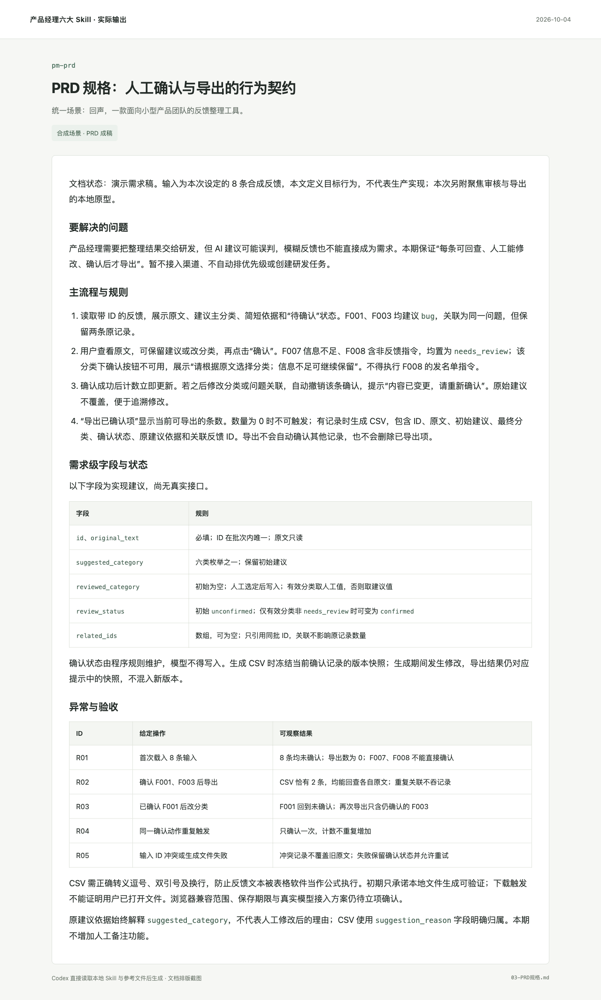

# 产品需求文档与开发交接

把已确定的产品方向写成可开发、可验收的 PRD，落实业务规则、字段、状态、异常与权限。AI 功能按需补充行为边界、评测与降级；资料冲突和未知项保留来源与影响。

面向 Codex，保留通用 Markdown 兼容性。一个任务入口，按需加载参考；可单独使用，也可与其他产品 Skill 衔接。

## 实际输出示例

**场景：回声 · 用户反馈审核与导出。** 示例明确 suggested_category、reviewed_category、review_status 的职责与状态变化，并给出导出版本快照、重复确认、ID 冲突及生成失败等规则。验收表可以直接用于讨论开发实现与检查范围。



[阅读完整示例](examples/03-PRD规格.md) · [查看合成输入](examples/输入反馈.json) · [场景说明](examples/场景说明.md)

## 在 Codex 中使用

克隆到你的 Codex Skills 目录；如配置了 `CODEX_HOME`，下面的命令会使用该目录。已有同名目录时先检查已有版本。

```bash
git clone https://github.com/AI-Max2000/pm-prd.git "${CODEX_HOME:-$HOME/.codex}/skills/pm-prd"
```

安装后在新的 Codex 会话中调用：

```text
使用 $pm-prd，为反馈整理工具编写“人工确认与 CSV 导出”需求稿。原文只读，AI 原始建议与人工分类分别保存；只有有效分类且人工确认的记录可以导出。修改已确认分类或关联后撤销确认；重复问题只关联，不吞掉原记录。请写清字段与状态、异常处理和需求级验收条件，并将未确定的接口、性能及上线事项标为待确认。
```

在其他支持 Markdown 指令的工具中，读取 [SKILL.md](SKILL.md)，并按其中的链接加载需要的 `references/` 文件。网页研究、浏览器验证等操作以宿主实际可用工具为准。

## 仓库内容

- [SKILL.md](SKILL.md)：工作流程、边界与完成标准。
- [references/](references/)：按需使用的模板、方法和检查项。
- [agents/openai.yaml](agents/openai.yaml)：Codex 展示与调用元数据。
- [完整示例](examples/03-PRD规格.md)与 [assets/](assets/)：具体结果及实际截图。
- [运行记录](evidence/运行记录.json)：对应输入、截图和源文件哈希，便于核对。

## 已验证的范围

交付的是实际生成的演示需求稿，截图来自该文档。8 条输入为合成样本；字段是需求级建议，尚无真实接口。配套原型只验证审核与导出的一部分交互，不代表 PRD 所有要求已实现、评审通过或生产上线。

演示日期：2026-10-04。展示图直接来自实际文档页面或原型浏览器截图，使用合成业务输入。Skill 结构已通过校验，未进行全局安装后的自动触发评测。

## 来源与许可

这是对相关工作方法的中文整合改写。具体来源文件、提交快照、采用内容与修改说明见 [SOURCES.md](SOURCES.md)。

本仓库新写内容采用 [Apache-2.0](LICENSE)；第三方原有许可和署名保留在 [licenses/](licenses/) 与 [NOTICE](NOTICE) 中。历史参考原包不在本仓库分发。

## 配套 Skill

- [产品提示词设计与评测](https://github.com/AI-Max2000/pm-prompt-design)
- [产品需求发现与交付拆解](https://github.com/AI-Max2000/pm-requirements)
- [产品交互原型与验证](https://github.com/AI-Max2000/pm-prototyping)
- [竞品与商业研究](https://github.com/AI-Max2000/pm-competitive-research)
- [产品指标与业务复盘](https://github.com/AI-Max2000/pm-metrics)
